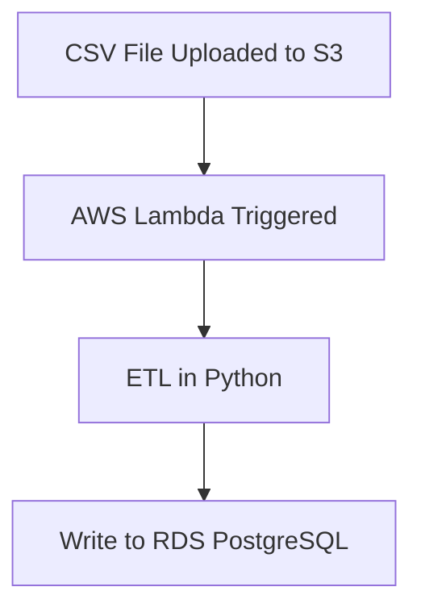

# Serverless Data Pipeline on AWS with Terraform

## Project Description

This project demonstrates how to deploy a **fully serverless data pipeline** using **AWS services** and **Terraform**. It is designed for learning, portfolio-building, or as a production-ready starting point for simple ETL tasks.

The pipeline is triggered when a CSV file is uploaded to **Amazon S3**, processes the file using an **AWS Lambda function written in Python**, and inserts the transformed data into a **PostgreSQL RDS** database.

All infrastructure is provisioned via **Infrastructure as Code (IaC)** using **Terraform** and is fully compatible with the **AWS Free Tier**.

---
## 🧱Architecture


##  Features

-  Automated ingestion of `.csv` files from S3
-  Python Lambda for file parsing and transformation
-  Data loaded into Amazon RDS (PostgreSQL)
-  Fine-grained IAM permissions for each component
-  Fully reproducible with Terraform

---

## Project Structure

```
data-pipeline-aws-terraform/
├── terraform/                 # Infrastructure code
│   ├── main.tf
│   ├── variables.tf
│   ├── outputs.tf
│   ├── s3.tf
│   ├── lambda.tf
│   ├── rds.tf
│   └── iam.tf
│
├── lambda/                    # Lambda source code
│   ├── etl_handler.py
│   └── requirements.txt
│
├── data/                      # Sample files for testing
│   └── sample.csv
│
├── docs/                      # Architecture diagrams
│   └── architecture.png
│
├── .gitignore
├── README.md
└── LICENSE
```
 ## How to Deploy

 1. Configure AWS CLI (once)
```
aws configure
```
2. Initialize and apply Terraform
```
cd terraform/
terraform init
terraform apply
```
3. Upload a CSV file to S3

Place a file (.csv) into the newly created S3 bucket (you’ll see the name in Terraform output):

```
aws s3 cp ../data/sample.csv s3://<the bucket name>/
```
4. Lambda will be triggered automatically

Check the logs in CloudWatch to debug or monitor the execution.


## Authored By me 
N'hésitez pas à me contacter sur LinkedIn en cas de problème ou piste d'amélioration.